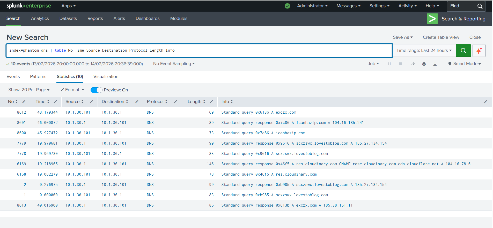
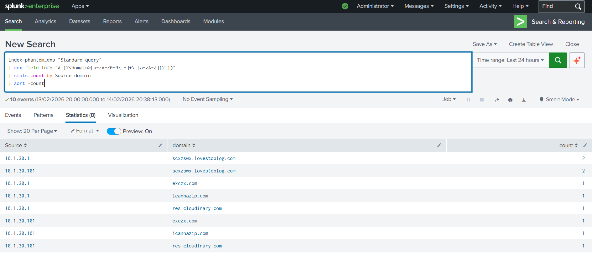

# Project 1: PhantomStealer DNS Traffic Analysis Using Splunk SIEM

## Objective
Analyze real-world DNS traffic from a PhantomStealer malware infection to detect Command & Control (C2) communication, identify beaconing behavior, and determine the compromised host using Splunk SIEM.

## Skills Learned
- Real-world malware traffic analysis
- DNS traffic pattern recognition
- Field extraction using regular expressions in Splunk
- Detection of DNS beaconing patterns
- Identification of malicious domains and C2 infrastructure
- Threat hunting using SPL (Search Processing Language)
- MITRE ATT&CK framework mapping
- PCAP file analysis with Wireshark

## Tools Used
- **Splunk Enterprise** - Security Information and Event Management (SIEM) system
- **Wireshark** - Network protocol analyzer for PCAP extraction
- **Malware Traffic Analysis** - Real-world malware PCAP repository

## Dataset Information
- **Source**: [Malware Traffic Analysis](https://www.malware-traffic-analysis.net/)
- **Sample Date**: 2026-01-30
- **Malware Family**: PhantomStealer
- **File**: `2026-01-30-PhantomStealer-infection.pcap.zip`
- **Password Format**: `infected_YYYYMMDD` → `infected_20260130`
- **Type**: DNS query and response logs
- **Format**: CSV exported from Wireshark
- **Analysis Scope**: 10 sample events (scalable to full PCAP)

---

## Investigation Workflow

### Phase 1: PCAP Acquisition

**Step 1: Download Malware PCAP**
1. Navigated to [malware-traffic-analysis.net](https://www.malware-traffic-analysis.net/)
2. Selected **2026-01-30 - PhantomStealer infection** exercise
3. Downloaded `2026-01-30-PhantomStealer-infection.pcap.zip`

**Step 2: Extract PCAP Safely**
1. Password: `infected_20260130`
2. Extracted `2026-01-30-PhantomStealer-infection.pcap`
3. ⚠️ **Safety Note**: Handled in isolated VM environment (Kali Linux)

---

### Phase 2: Traffic Extraction

**Step 3: Open PCAP in Wireshark**
1. Launched Wireshark on Kali Linux
2. File → Open → Selected `2026-01-30-PhantomStealer-infection.pcap`
3. Initial inspection showed mixed traffic (DNS, HTTP, TLS)

**Step 4: Filter DNS Traffic**
Applied display filter:
```
dns
```
This isolated all DNS queries and responses from the infection traffic.

**Step 5: Export DNS Logs**
1. File → Export Packet Dissections → As CSV
2. Selected "Displayed packets only" (DNS filtered)
3. Saved as `dns_logs.csv`
4. Transferred file to Windows machine running Splunk Enterprise

---

### Phase 3: Splunk Data Ingestion

**Step 6: Create Custom Index**
```
Settings → Indexes → New Index
Index Name: phantom_dns
```

**Step 7: Upload Data**
```
Settings → Add Data → Upload
File: dns_logs.csv
Source Type: csv
Index: phantom_dns
```

**Step 8: Verify Ingestion**
Query:
```spl
index=phantom_dns
```
Result: 10 events successfully indexed

---

### Phase 4: Field Extraction

**Step 9: Manual Field Parsing**

Since Splunk treated the CSV as a single quoted string, manual field extraction was required.

**Regex Pattern Used:**
```regex
"(?<No>[^"]+)","(?<Time>[^"]+)","(?<Source>[^"]+)","(?<Destination>[^"]+)","(?<Protocol>[^"]+)","(?<Length>[^"]+)","(?<Info>[^"]+)"
```

**Fields Successfully Extracted:**
- `No` - Packet number
- `Time` - Relative timestamp
- `Source` - Query originator IP
- `Destination` - DNS server IP
- `Protocol` - DNS
- `Length` - Packet size
- `Info` - Query details (domain, type, status)

**Verification Query:**
```spl
index=phantom_dns 
| table No Time Source Destination Protocol Length Info
```



---

### Phase 5: Threat Hunting Analysis

**Step 10: Domain Frequency Analysis**

**Objective:** Identify which domains were queried most frequently

**Query:**
```spl
index=phantom_dns
| rex field=Info "A (?<domain>[a-zA-Z0-9\.-]+\.[a-zA-Z]{2,})"
| stats count by domain
| sort -count
```

**Results:**

| Domain | Count | Assessment |
|--------|-------|------------|
| scxzswx.lovestoblog.com | 4 | 🔴 **HIGHLY SUSPICIOUS** - Random subdomain, repeated queries |
| exczx.com | 2 | 🔴 **SUSPICIOUS** - Short random domain |
| icanhazip.com | 2 | 🟡 **SUSPICIOUS BEHAVIOR** - Legitimate IP lookup service, but used by malware |
| res.cloudinary.com | 2 | 🟢 **LEGITIMATE** - CDN traffic |


**Analysis:**
- `scxzswx.lovestoblog.com` exhibits highest query frequency
- Random-looking subdomain pattern typical of DGA (Domain Generation Algorithm) or temporary C2 infrastructure
- Hosted on free blogging platform - common tactic for disposable C2 domains

---

**Step 11: Beaconing Detection**

**Objective:** Detect repeated DNS queries indicating C2 beaconing behavior

**Query:**
```spl
index=phantom_dns
| rex field=Info "A (?<domain>[a-zA-Z0-9\.-]+\.[a-zA-Z]{2,})"
| stats count by domain
| where count > 1
```

**Finding:**
Multiple domains showed repeated queries, but **`scxzswx.lovestoblog.com`** with **4 queries** strongly indicates active C2 beaconing.


**Beaconing Indicators:**
- Regular interval DNS lookups
- Same domain repeatedly queried
- Consistent pattern matching malware callback behavior

---

**Step 12: Compromised Host Identification**

**Objective:** Determine which internal host is infected

**Query:**
```spl
index=phantom_dns "Standard query"
| rex field=Info "A (?<domain>[a-zA-Z0-9\.-]+\.[a-zA-Z]{2,})"
| stats count by Source domain
| sort -count
```

**Finding:**

**🚨 Infected Host: `10.1.30.101`**

This internal IP generated all suspicious DNS queries to malicious infrastructure.



**Host Profile:**
- Internal IP: `10.1.30.101`
- DNS Server: `10.1.30.1`
- Behavior: Initiated multiple queries to suspicious domains
- Classification: **Compromised endpoint**

---

## 🔍 Key Findings

### Indicators of Compromise (IOCs)

**Malicious Domains:**
```
scxzswx.lovestoblog.com → 185.27.134.154
exczx.com → 185.38.151.11
```

**Compromised Asset:**
```
Internal IP: 10.1.30.101
Network Segment: 10.1.30.0/24
```

**Behavioral Indicators:**
- ✅ DNS beaconing (4 queries to C2 domain)
- ✅ External IP discovery via icanhazip.com
- ✅ Communication with free hosting infrastructure
- ✅ Algorithmically-generated or random subdomain usage
- ✅ Queries to newly registered/suspicious domains

---

### Attack Timeline
```
1. Initial Infection
   └─> Host 10.1.30.101 compromised with PhantomStealer

2. Reconnaissance
   └─> Malware queries icanhazip.com to discover public IP

3. C2 Establishment
   └─> Repeated DNS queries to scxzswx.lovestoblog.com
   └─> Beaconing pattern establishes C2 channel

4. Infrastructure Communication
   └─> Additional queries to exczx.com
   └─> Multiple suspicious domains contacted
```

---

### Malware Behavior Analysis

**PhantomStealer Characteristics Observed:**
1. **Initial reconnaissance** - Public IP discovery
2. **C2 communication** - DNS-based beaconing
3. **Infrastructure diversity** - Multiple domains used
4. **Stealth tactics** - Free hosting platforms, random subdomains

**Typical PhantomStealer Capabilities:**
- Credential theft
- Browser data exfiltration
- Session token stealing
- Cryptocurrency wallet harvesting
- Discord token theft

---

## 🎯 MITRE ATT&CK Framework Mapping

| Tactic | Technique | ID | Evidence |
|--------|-----------|----|----|
| Discovery | System Network Configuration Discovery | [T1016](https://attack.mitre.org/techniques/T1016/) | Public IP lookup via icanhazip.com |
| Command and Control | Application Layer Protocol: DNS | [T1071.004](https://attack.mitre.org/techniques/T1071/004/) | Repeated DNS queries to C2 domain |
| Discovery | System Network Configuration Discovery | T1016 | Public IP lookup via icanhazip.com |
| Command and Control | Application Layer Protocol: DNS | T1071.004 | Repeated DNS queries to suspicious domain indicating beaconing |
---

## 🛡️ Recommendations

### Immediate Response Actions

**1. Containment:**
```
- Isolate host 10.1.30.101 from network immediately
- Disable network adapters on infected system
- Preserve memory dump for forensic analysis
```

**2. Blocking:**
```
- Firewall block: 185.27.134.154, 185.38.151.11
- DNS sinkhole: scxzswx.lovestoblog.com, exczx.com
- Update threat intelligence feeds with IOCs
```

**3. Investigation:**
```
- Examine host 10.1.30.101 for:
  - Running processes
  - Scheduled tasks
  - Persistence mechanisms
  - Stolen credentials
- Check for lateral movement to other hosts
- Review authentication logs for compromised accounts
```

---

### Detection Rules

**Splunk Alert - Repeated DNS Queries (Beaconing Detection):**
```spl
index=dns_logs
| rex field=query "(?<domain>[a-zA-Z0-9\.-]+\.[a-zA-Z]{2,})"
| stats count by src_ip domain
| where count > 3
| table src_ip domain count
```

**Splunk Alert - Public IP Lookup Services:**
```spl
index=dns_logs query IN ("icanhazip.com", "ipinfo.io", "api.ipify.org", "checkip.amazonaws.com")
| stats count by src_ip query
| where count > 1
```

**Splunk Alert - Suspicious TLDs:**
```spl
index=dns_logs
| rex field=query "\.(?<tld>[a-z]{2,})$"
| where tld IN ("xyz", "top", "ru", "cn", "tk")
| stats count by src_ip query tld
```

---

### Long-term Security Improvements

1. **DNS Security:**
   - Deploy DNS filtering (Cisco Umbrella, Cloudflare Gateway)
   - Implement DNS sinkholing for known malicious domains
   - Enable DNS logging for all endpoints

2. **Endpoint Protection:**
   - Deploy EDR solution on all workstations
   - Enable application whitelisting
   - Regular credential rotation policy

3. **Network Monitoring:**
   - Continuous Splunk monitoring for DNS anomalies
   - Baseline normal DNS query patterns
   - Alert on deviation from baseline

4. **Threat Intelligence:**
   - Subscribe to malware IOC feeds
   - Integrate threat intelligence with SIEM
   - Regular IOC hunting exercises

---

## 📊 Conclusion

This investigation successfully identified and analyzed DNS-based Command & Control communication from a **PhantomStealer malware infection**. 

Through systematic analysis using Splunk SIEM:
- ✅ Detected beaconing behavior through DNS query pattern analysis
- ✅ Identified compromised host (10.1.30.101)
- ✅ Extracted actionable IOCs for remediation
- ✅ Mapped attack techniques to MITRE ATT&CK framework
- ✅ Developed detection rules for future prevention

The analysis demonstrates the critical importance of DNS traffic monitoring as a key component of network security monitoring and threat detection capabilities.

**Key Takeaway:** Even with minimal sample data (10 events), structured analysis methodology can effectively identify sophisticated malware communication patterns.

---

## 📚 References

- [Malware Traffic Analysis - PhantomStealer Exercise](https://www.malware-traffic-analysis.net/)
- [MITRE ATT&CK Framework](https://attack.mitre.org/)
- [Splunk Documentation](https://docs.splunk.com/)
- [DNS Tunneling Detection Techniques](https://www.sans.org/white-papers/)

---


**Project Date:** February 2026  
**Analysis Platform:** Splunk Enterprise  
**Analyst:** [Rohit Aswal]
