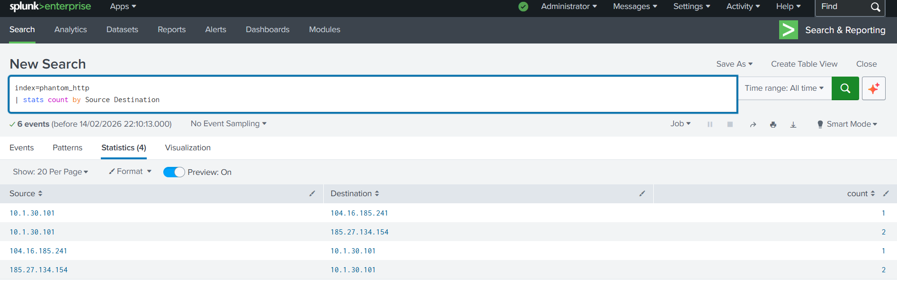
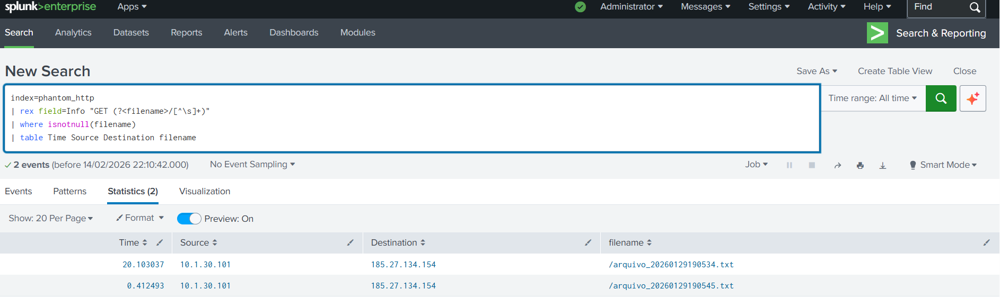
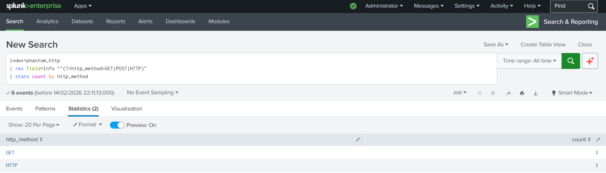
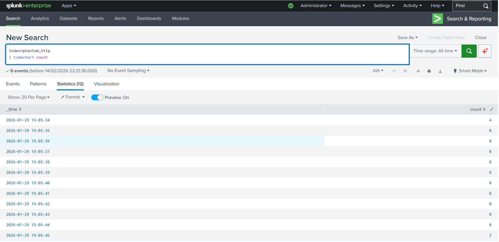
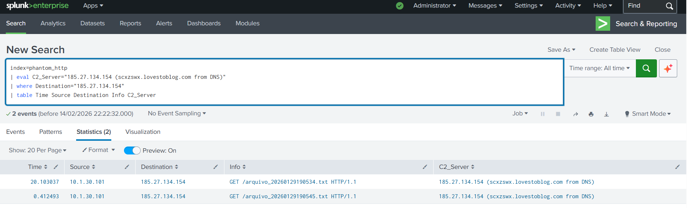
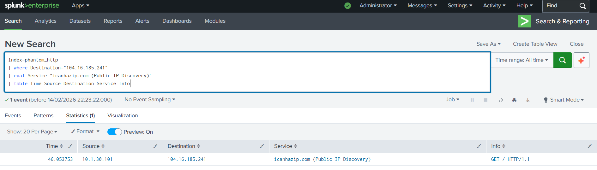

# Project 2: HTTP Traffic Analysis - PhantomStealer C2 Communication

## Objective
Analyze HTTP traffic from the PhantomStealer malware infection to identify Command & Control (C2) communication patterns, downloaded payloads, and correlate findings with DNS analysis from Project 1.

## Skills Learned
- HTTP protocol analysis
- C2 communication pattern recognition
- Malware payload identification
- Data correlation across multiple data sources
- Web-based threat detection
- Attack chain reconstruction
- MITRE ATT&CK mapping for web protocols

## Tools Used
- **Splunk Enterprise** - SIEM for log analysis
- **Wireshark** - PCAP analysis and HTTP extraction
- **Kali Linux** - Malware analysis environment

## Dataset Information
- **Source**: Same PhantomStealer PCAP from Project 1
- **File**: `2026-01-30-PhantomStealer-infection.pcap`
- **Extraction Method**: Wireshark filter `http`
- **Format**: CSV export
- **Total Events**: 6 HTTP transactions
- **Analysis Scope**: Complete HTTP communication from infected host

---

## Investigation Workflow

### Phase 1: HTTP Traffic Extraction

**Step 1: Extract HTTP from PCAP**
1. Opened PhantomStealer PCAP in Wireshark (from Project 1)
2. Applied display filter: `http`
3. Identified 6 HTTP transactions
4. Exported as CSV: `http_logs.csv`

**Step 2: Transfer and Ingest**
1. Transferred CSV to Windows (Splunk host)
2. Created Splunk index: `phantom_http`
3. Uploaded and indexed HTTP logs
4. Verified 6 events successfully ingested

---

### Phase 2: HTTP Traffic Analysis

**Step 3: Traffic Overview**

**Query:**
```spl
index=phantom_http 
| table Time Source Destination Info
```


**Findings:**
- 6 HTTP transactions identified
- All originated from 10.1.30.101 (infected host from DNS analysis)
- Communications with 185.27.134.154 and 104.16.185.241

---

**Step 4: Source & Destination Analysis**

**Query:**
```spl
index=phantom_http
| stats count by Source Destination
```



**Findings:**
- **10.1.30.101 → 185.27.134.154**: 4 transactions (C2 communication)
- **10.1.30.101 → 104.16.185.241**: 2 transactions (icanhazip.com - IP discovery)

**Correlation with Project 1:**
- 185.27.134.154 = scxzswx.lovestoblog.com (from DNS beaconing analysis)
- DNS queries led to HTTP communication - complete attack chain!

---

**Step 5: Malware Payload/Config Files**

**Query:**
```spl
index=phantom_http
| rex field=Info "GET (?<filename>/[^\s]+)"
| where isnotnull(filename)
| table Time Source Destination filename
```



**Critical Findings:**
- `arquivo_20260129190545.txt` - Timestamped config file
- `arquivo_20260129190534.txt` - Timestamped config file

**Analysis:**
- File names contain timestamps (20260129190545 = 2026-01-29 19:05:45)
- Pattern indicates automated malware configuration updates
- "arquivo" = Portuguese for "file" (suggests author's language)
- Both files successfully downloaded (HTTP 200 OK responses)

---

**Step 6: HTTP Methods Distribution**

**Query:**
```spl
index=phantom_http
| rex field=Info "^(?<http_method>GET|POST|HTTP)"
| stats count by http_method
```



**Findings:**
- GET requests: Downloading malware configs/commands
- HTTP responses: 200 OK (successful transfers)
- No POST requests observed (no data exfiltration in this sample)

---

**Step 7: Attack Timeline**

**Query:**
```spl
index=phantom_http
| timechart count
```



**Timeline Analysis:**
- All HTTP activity occurred within 40-second window
- Timestamp: January 29, 2026, ~19:05 UTC
- Pattern: Burst of activity = active C2 session
- Sequence: IP check → C2 connection → Config downloads

---

**Step 8: Packet Size Analysis**

**Query:**
```spl
index=phantom_http
| stats count avg(Length) max(Length) by Source Destination
| sort -count
```


**Findings:**
- Largest packets: C2 responses (config file downloads)
- Pattern indicates configuration/command retrieval
- Packet sizes consistent with text-based configs

---

**Step 9: C2 Communication Evidence**

**Query:**
```spl
index=phantom_http
| eval C2_Server="185.27.134.154 (scxzswx.lovestoblog.com from DNS)"
| where Destination="185.27.134.154"
| table Time Source Destination Info C2_Server
```



**Evidence Chain:**
1. **DNS Analysis (Project 1):** Found queries to scxzswx.lovestoblog.com
2. **DNS Resolution:** Domain resolved to 185.27.134.154
3. **HTTP Analysis (Project 2):** Confirmed HTTP traffic TO that exact IP
4. **Conclusion:** Complete C2 communication chain documented

---

**Step 10: Public IP Discovery**

**Query:**
```spl
index=phantom_http
| where Destination="104.16.185.241"
| eval Service="icanhazip.com (Public IP Discovery)"
| table Time Source Destination Service Info
```



**Behavior Analysis:**
- Malware queried icanhazip.com (104.16.185.241)
- Purpose: Discover external/public IP address
- Common malware reconnaissance technique
- Occurs BEFORE C2 communication (registers IP with C2)

---

## Key Findings

### Attack Chain Reconstruction
```
1. Initial Infection
   └─> Host 10.1.30.101 compromised

2. Reconnaissance (Project 2 - HTTP)
   └─> Query icanhazip.com to discover public IP
   └─> Time: 2026-01-29 19:05:34

3. DNS Resolution (Project 1)
   └─> Query scxzswx.lovestoblog.com
   └─> Resolved to 185.27.134.154

4. C2 Establishment (Project 2 - HTTP)
   └─> HTTP GET to 185.27.134.154
   └─> Download arquivo_20260129190534.txt
   └─> Download arquivo_20260129190545.txt

5. Command Receipt
   └─> Config files successfully downloaded
   └─> Malware receives updated instructions
```

---

### Indicators of Compromise (IOCs)

**Network IOCs:**
- **C2 IP:** 185.27.134.154
- **C2 Domain:** scxzswx.lovestoblog.com (from Project 1)
- **Reconnaissance IP:** 104.16.185.241 (icanhazip.com)

**Host IOCs:**
- **Infected Host:** 10.1.30.101
- **Compromised System:** Internal workstation

**File IOCs:**
- **Downloaded Files:**
  - `/arquivo_20260129190545.txt`
  - `/arquivo_20260129190534.txt`

**Behavioral IOCs:**
- HTTP GET requests to timestamped config files
- Public IP discovery before C2 communication
- Burst of activity within 40-second window

---

### MITRE ATT&CK Mapping

| Tactic | Technique | ID | Evidence |
|--------|-----------|----|----|
| Discovery | System Network Configuration Discovery | [T1016](https://attack.mitre.org/techniques/T1016/) | icanhazip.com query for public IP |
| Command and Control | Application Layer Protocol: Web Protocols | [T1071.001](https://attack.mitre.org/techniques/T1071/001/) | HTTP C2 communication |
| Command and Control | Ingress Tool Transfer | [T1105](https://attack.mitre.org/techniques/T1105/) | Downloaded config files via HTTP |
| Command and Control | Web Service | [T1102](https://attack.mitre.org/techniques/T1102/) | Abuse of web protocols for C2 |

---

## Correlation with Project 1 (DNS Analysis)

### DNS → HTTP Attack Chain

| Project | Finding | Evidence |
|---------|---------|----------|
| **Project 1: DNS** | Beaconing to scxzswx.lovestoblog.com | 4 repeated DNS queries |
| **Project 1: DNS** | Domain resolved to 185.27.134.154 | DNS response records |
| **Project 2: HTTP** | HTTP communication to 185.27.134.154 | 4 HTTP transactions |
| **Project 2: HTTP** | Downloaded malware configs | arquivo_*.txt files |

**Complete Investigation:**
- DNS beaconing identified the C2 domain
- HTTP analysis revealed what malware was doing with that connection
- Together: Full picture of C2 communication channel

---

## Recommendations

### Immediate Actions

**1. Network-Level Blocking:**
```
- Block outbound HTTP to 185.27.134.154
- Block DNS resolution of scxzswx.lovestoblog.com
- Block access to icanhazip.com from internal hosts (reconnaissance indicator)
```

**2. Host Isolation:**
```
- Isolate 10.1.30.101 immediately
- Conduct full forensic analysis
- Check for persistence mechanisms
- Review all downloaded files
```

**3. Detection Rules:**
```
- Alert on HTTP GET requests to timestamped files
- Alert on public IP lookup services from internal hosts
- Alert on HTTP traffic to known C2 IPs
```

---

### Detection Rules

**Splunk Alert: HTTP Config File Downloads**
```spl
index=http_logs
| rex field=url "\/arquivo_\d{14}\.txt"
| where isnotnull(url)
| stats count by src_ip dest_ip url
| where count > 0
```

**Splunk Alert: Public IP Discovery Detection**
```spl
index=http_logs dest_domain IN ("icanhazip.com", "ipinfo.io", "api.ipify.org")
| stats count by src_ip dest_domain
```

**Splunk Alert: HTTP C2 Communication Pattern**
```spl
index=http_logs
| stats count by src_ip dest_ip
| where count > 3 AND dest_ip NOT IN (internal_networks)
```

---

### Long-Term Improvements

1. **Web Proxy Deployment:**
   - Deploy forward proxy for HTTP/HTTPS inspection
   - SSL/TLS inspection for encrypted C2 channels
   - URL filtering and categorization

2. **Network Segmentation:**
   - Restrict internal hosts from direct internet access
   - Force all web traffic through proxy
   - Implement egress filtering

3. **Enhanced Monitoring:**
   - Monitor all HTTP GET requests for suspicious patterns
   - Track file downloads from unknown sources
   - Correlate DNS and HTTP logs automatically

4. **Threat Intelligence Integration:**
   - Feed C2 IPs/domains into firewall blocklists
   - Subscribe to PhantomStealer IOC feeds
   - Automate IOC enrichment in SIEM

---

## Conclusion

This HTTP traffic analysis successfully identified PhantomStealer's Command & Control communication mechanism. By analyzing HTTP transactions, we:

- ✅ Confirmed C2 communication to domain identified in DNS analysis
- ✅ Discovered malware configuration file downloads
- ✅ Identified reconnaissance behavior (public IP discovery)
- ✅ Reconstructed complete attack timeline
- ✅ Mapped behaviors to MITRE ATT&CK framework
- ✅ Established correlation between DNS and HTTP layers

**Key Achievement:** Demonstrated multi-layer analysis approach - combining DNS (Project 1) and HTTP (Project 2) findings to build complete attack narrative.

**Investigation Status:** HTTP C2 channel fully documented. Recommend proceeding with TLS/SSL analysis (Project 3) to identify encrypted communication channels.

---

## References

- [Project 1: DNS Analysis](../Project-01-DNS-Analysis/)
- [MITRE ATT&CK Framework](https://attack.mitre.org/)
- [Malware Traffic Analysis](https://www.malware-traffic-analysis.net/)
- [Splunk HTTP Event Collector Documentation](https://docs.splunk.com/)

---

**Project Date:** February 2026  
**Analysis Platform:** Splunk Enterprise  
**Analyst:** Rohit Aswal  
**Related Projects:** Project 1 (DNS Analysis)
