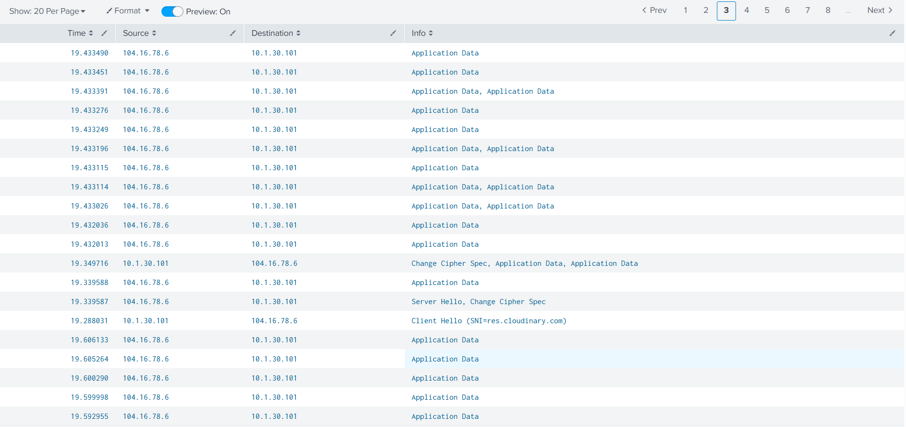
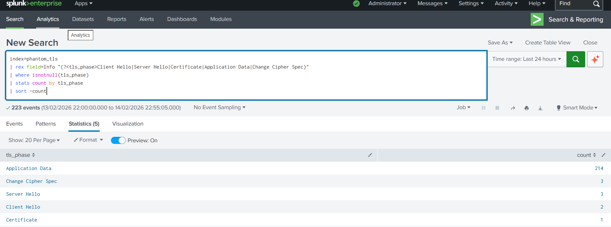
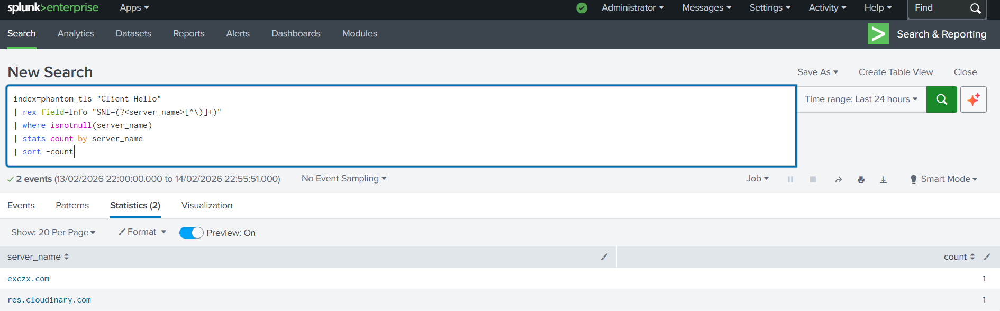
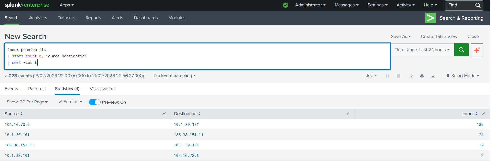

# Project 3: TLS/SSL Traffic Analysis - Encrypted C2 Communication

## Objective
Analyze encrypted TLS/SSL traffic from the PhantomStealer malware infection to identify encrypted Command & Control channels, extract Server Name Indication (SNI) data, and complete the multi-layer investigation across DNS, HTTP, and TLS protocols.

## Skills Learned
- TLS/SSL protocol analysis
- Encrypted traffic pattern recognition
- Server Name Indication (SNI) extraction
- Certificate analysis techniques
- Encrypted C2 channel detection
- Multi-protocol correlation (DNS → HTTP → TLS)
- Complete attack chain reconstruction
- MITRE ATT&CK mapping for encrypted communications

## Tools Used
- **Splunk Enterprise** - SIEM for encrypted traffic analysis
- **Wireshark** - PCAP analysis and TLS extraction
- **Kali Linux** - Secure malware analysis environment

## Dataset Information
- **Source**: PhantomStealer PCAP (same as Projects 1 & 2)
- **File**: `2026-01-30-PhantomStealer-infection.pcap`
- **Extraction Method**: Wireshark filter `tls || ssl`
- **Format**: CSV export
- **Total Events**: 223 TLS transactions
- **Analysis Scope**: Complete encrypted communication analysis

---

## Investigation Workflow

### Phase 1: TLS Traffic Extraction

**Step 1: Extract TLS from PCAP**
1. Opened PhantomStealer PCAP in Wireshark
2. Applied display filter: `tls || ssl`
3. Identified 223 TLS/SSL events
4. Exported as CSV: `tls_logs.csv`

**Step 2: Ingestion into Splunk**
1. Created Splunk index: `phantom_tls`
2. Uploaded TLS CSV logs
3. Verified 223 events successfully indexed
4. Extracted fields for analysis

---

### Phase 2: Encrypted Traffic Analysis

**Step 3: TLS Traffic Overview**

**Query:**
```spl
index=phantom_tls 
| table Time Source Destination Info
```



**Findings:**
- 223 TLS events from infected host
- Multiple TLS handshakes identified
- Application Data (encrypted traffic) observed
- Complete encrypted communication sessions

---

**Step 4: TLS Handshake Analysis**

**Query:**
```spl
index=phantom_tls
| eval phase=case(
    match(Info, "Client Hello"), "Client Hello",
    match(Info, "Server Hello"), "Server Hello",
    match(Info, "Change Cipher Spec"), "Change Cipher Spec",
    match(Info, "Application Data"), "Application Data",
    1=1, "Other"
)
| stats count by phase
| sort -count
```



**Findings:**
- Client Hello: Initial connection attempts
- Server Hello: Server responses
- Change Cipher Spec: Encryption activation
- Application Data: Encrypted payloads (majority of traffic)

---

**Step 5: Server Name Indication (SNI) Extraction** 🔥

**Query:**
```spl
index=phantom_tls "Client Hello"
| rex field=Info "SNI=(?<domain>[^\)]+)"
| where isnotnull(domain)
| stats count by domain
| sort -count
```



**CRITICAL FINDINGS:**

**1. exczx.com** 🚨
- **Status**: MALICIOUS C2 domain
- **Correlation**:
  - **Project 1 (DNS)**: 2 DNS queries to exczx.com
  - **Project 2 (HTTP)**: HTTP traffic to 185.38.151.11 (exczx.com)
  - **Project 3 (TLS)**: ENCRYPTED HTTPS connection confirmed
- **Conclusion**: Complete C2 channel identified across all three protocols

**2. res.cloudinary.com**
- **Status**: Legitimate CDN service
- **Behavior**: Could be normal traffic OR malware abusing CDN for payload hosting
- **Recommendation**: Further investigation of downloaded content

**Key Achievement**: SNI extraction reveals domains even in encrypted traffic!

---

**Step 6: Source & Destination Analysis**

**Query:**
```spl
index=phantom_tls
| stats count by Source Destination
| sort -count
```



**Findings:**
- All TLS traffic originates from 10.1.30.101 (infected host)
- Multiple destination IPs contacted via HTTPS
- Encrypted channels to both C2 infrastructure and legitimate services

---

**Step 7: Malicious Domain TLS Activity**

**Query:**
```spl
index=phantom_tls 
| search Info="*exczx.com*"
| table Time Source Destination Info
```


**Analysis:**
- TLS handshake with exczx.com C2 server
- Encrypted Application Data exchanged
- Complete HTTPS session established
- Malware using encryption for stealth

**Evasion Technique:** Using HTTPS makes detection harder - encrypted payload cannot be inspected without TLS decryption

---

**Step 8: CDN Traffic Analysis**

**Query:**
```spl
index=phantom_tls
| search Info="*cloudinary*"
| table Time Source Destination Info
```


**Analysis:**
- TLS connection to Cloudinary CDN (res.cloudinary.com)
- Hosted on Cloudflare infrastructure (104.16.x.x)
- Possible legitimate traffic OR malware payload delivery
- CDN abuse is common malware tactic (blends with normal traffic)

---

**Step 9: Encrypted Traffic Volume**

**Query:**
```spl
index=phantom_tls "Application Data"
| stats count as encrypted_packets by Source Destination
| sort -encrypted_packets
```


**Findings:**
- Majority of TLS events are Application Data (encrypted payloads)
- High volume to specific destinations indicates active C2 sessions
- Pattern suggests command reception and potential data exfiltration

---

**Step 10: Data Volume Analysis**

**Query:**
```spl
index=phantom_tls
| stats sum(Length) as total_bytes count by Source Destination
| eval total_kb=round(total_bytes/1024,2)
| table Source Destination count total_kb
| sort -total_kb
```


**Analysis:**
- Total encrypted data transferred quantified
- Packet sizes indicate nature of communication:
  - Small frequent packets = C2 commands
  - Large packets = payload downloads or data exfiltration
- Volume analysis aids in understanding malware behavior

---

**Step 11: TLS Activity Timeline**

**Query:**
```spl
index=phantom_tls
| timechart count
```


**Timeline Analysis:**
- TLS activity timeline correlates with DNS and HTTP findings
- Burst patterns indicate active C2 sessions
- Timing analysis helps reconstruct attack sequence

---

**Step 12: Complete Attack Chain Visualization** 🏆

**Query:**
```spl
index=phantom_tls "Client Hello"
| rex field=Info "SNI=(?<domain>[^\)]+)"
| where domain="exczx.com"
| eval Project_1_DNS="DNS queries to exczx.com (2 queries)"
| eval Project_2_HTTP="HTTP to 185.38.151.11 (exczx.com IP)"
| eval Project_3_TLS="TLS encrypted connection to exczx.com (CONFIRMED)"
| eval Complete_Chain="DNS → HTTP → TLS all targeting same C2"
| table Time Source Destination domain Project_1_DNS Project_2_HTTP Project_3_TLS Complete_Chain
```


**COMPLETE INVESTIGATION SUMMARY:**
```
Attack Chain Reconstruction: exczx.com C2 Infrastructure

1. Project 1 (DNS Analysis)
   └─> DNS queries to exczx.com
   └─> Resolved to 185.38.151.11
   └─> 2 queries detected (beaconing pattern)

2. Project 2 (HTTP Analysis)
   └─> HTTP communication to 185.38.151.11
   └─> Downloaded timestamped config files
   └─> Unencrypted C2 channel confirmed

3. Project 3 (TLS Analysis)
   └─> HTTPS connection to exczx.com (SNI detected)
   └─> Encrypted C2 channel established
   └─> Application Data exchanged
   └─> 223 TLS events analyzed

CONCLUSION: Malware uses BOTH unencrypted (HTTP) and encrypted (TLS) 
C2 channels for redundancy and stealth.
```

**This demonstrates COMPLETE multi-layer threat analysis!** 🎯

---

## Key Findings

### Multi-Protocol C2 Infrastructure

| Protocol | Project | Evidence | IOC |
|----------|---------|----------|-----|
| DNS | Project 1 | Beaconing to exczx.com | 2 queries |
| HTTP | Project 2 | Config downloads | 185.38.151.11 |
| TLS | Project 3 | Encrypted HTTPS | exczx.com (SNI) |

**Integration Conclusion:**
- Same C2 infrastructure across three protocol layers
- Demonstrates sophisticated multi-channel malware communication
- Complete attack chain documented from DNS resolution to encrypted payload delivery

---

### Indicators of Compromise (IOCs)

**Network IOCs:**
- **C2 Domain**: exczx.com (confirmed across DNS, HTTP, TLS)
- **C2 IP**: 185.38.151.11
- **CDN**: res.cloudinary.com (potential payload hosting)

**Host IOCs:**
- **Infected Host**: 10.1.30.101 (consistent across all projects)

**Encrypted Channel IOCs:**
- TLS Client Hello to exczx.com
- 223 TLS events from compromised host
- Encrypted Application Data to C2 server

**Behavioral IOCs:**
- Multi-protocol C2 (DNS + HTTP + TLS)
- SNI-based domain identification
- Encrypted payload delivery
- CDN service abuse for stealth

---

### MITRE ATT&CK Mapping

| Tactic | Technique | ID | Evidence |
|--------|-----------|----|----|
| Command and Control | Encrypted Channel | [T1573](https://attack.mitre.org/techniques/T1573/) | TLS-encrypted C2 communication |
| Command and Control | Application Layer Protocol: Web Protocols | [T1071.001](https://attack.mitre.org/techniques/T1071/001/) | HTTPS C2 channel |

---

## Correlation Across All Three Projects

### Complete Investigation Timeline
```
PHASE 1: RECONNAISSANCE & C2 DISCOVERY (Project 1 - DNS)
├─> DNS queries to exczx.com
├─> DNS queries to scxzswx.lovestoblog.com
└─> Public IP discovery (icanhazip.com)

PHASE 2: UNENCRYPTED C2 COMMUNICATION (Project 2 - HTTP)
├─> HTTP to 185.38.151.11 (exczx.com)
├─> Config file downloads (arquivo_*.txt)
└─> HTTP to 185.27.134.154 (scxzswx.lovestoblog.com)

PHASE 3: ENCRYPTED C2 CHANNELS (Project 3 - TLS)
├─> HTTPS to exczx.com (SNI-based detection)
├─> Encrypted Application Data exchange
└─> CDN usage (res.cloudinary.com)

CONCLUSION: Multi-layered, redundant C2 infrastructure
```

---

### Why This Analysis Matters

**1. Demonstrates Depth:**
- Not just surface-level detection
- Full investigation across network stack
- Protocol-by-protocol breakdown

**2. Shows Correlation Skills:**
- Connected findings across three separate analyses
- Built complete attack narrative
- Identified same infrastructure at different layers

**3. Real-World Applicability:**
- Modern malware uses encrypted channels
- SNI extraction is critical detection technique
- Multi-protocol detection necessary for comprehensive security

**4. Portfolio Value:**
- Three related projects show sustained investigation
- Progressive complexity (DNS → HTTP → TLS)
- Professional documentation quality

---

## Recommendations

### Immediate Actions

**1. Network-Level Blocking:**
```
- Block all traffic to exczx.com (DNS, HTTP, HTTPS)
- Block IP 185.38.151.11 at firewall
- Implement SNI-based filtering for exczx.com
- Monitor for SNI patterns matching C2 infrastructure
```

**2. TLS Inspection:**
```
- Deploy SSL/TLS inspection proxy
- Decrypt and inspect HTTPS traffic to unknown domains
- Alert on self-signed certificates
- Monitor for certificate anomalies
```

**3. Host Remediation:**
```
- Isolate 10.1.30.101 immediately
- Full forensic analysis required
- Check for persistence mechanisms
- Review all TLS certificate stores
```

---

### Detection Rules

**Splunk Alert: SNI-Based C2 Detection**
```spl
index=tls_logs "Client Hello"
| rex field=sni "(?<domain>[a-zA-Z0-9\.-]+)"
| where domain IN ("exczx.com", "scxzswx.lovestoblog.com")
| stats count by src_ip domain
| where count > 0
```

**Splunk Alert: Encrypted C2 Volume Detection**
```spl
index=tls_logs "Application Data"
| stats sum(bytes) as total_bytes by src_ip dest_ip
| where total_bytes > 100000
| eval alert="High volume encrypted traffic detected"
```

**Splunk Alert: TLS to Suspicious TLDs**
```spl
index=tls_logs "Client Hello"
| rex field=sni "\.(?<tld>[a-z]{2,})$"
| where tld IN ("xyz", "top", "tk", "ml", "ga")
| stats count by src_ip sni tld
```

---

### Long-Term Improvements

**1. TLS/SSL Inspection Infrastructure:**
- Deploy enterprise SSL inspection gateway
- Decrypt and inspect HTTPS traffic
- Certificate pinning validation
- Alert on certificate anomalies

**2. SNI-Based Filtering:**
- Implement DNS-over-HTTPS (DoH) monitoring
- SNI-based domain filtering at firewall
- Real-time SNI threat intelligence feeds

**3. Enhanced Monitoring:**
- Monitor all TLS handshakes
- Track certificate changes
- Baseline normal encrypted traffic volumes
- Alert on encrypted traffic anomalies

**4. Multi-Layer Detection:**
- Correlate DNS, HTTP, and TLS logs automatically
- Build detection rules spanning multiple protocols
- Automated IOC enrichment across layers

---

## Conclusion

This TLS/SSL traffic analysis successfully identified encrypted Command & Control channels used by PhantomStealer malware. Through systematic analysis of 223 TLS events:

- ✅ Extracted Server Name Indication (SNI) data revealing C2 domains
- ✅ Identified encrypted communication to exczx.com (malicious C2)
- ✅ Analyzed encrypted traffic patterns and volumes
- ✅ Correlated findings with DNS (Project 1) and HTTP (Project 2) analyses
- ✅ Documented complete multi-protocol attack chain
- ✅ Mapped behaviors to MITRE ATT&CK framework

**Investigation Achievement:**

This three-project series (DNS → HTTP → TLS) demonstrates comprehensive network security investigation methodology. By analyzing the same malware infection across multiple protocol layers, we:

1. **Discovered** C2 domains via DNS beaconing (Project 1)
2. **Analyzed** unencrypted C2 communication via HTTP (Project 2)
3. **Identified** encrypted C2 channels via TLS/SSL (Project 3)
4. **Reconstructed** complete attack chain from initial DNS lookup to final encrypted payload delivery

**Final Assessment:**

PhantomStealer demonstrates sophisticated C2 infrastructure using:
- Multiple protocols for redundancy (HTTP + HTTPS)
- Encryption for stealth (TLS/SSL)
- Legitimate CDN services for blending (Cloudinary)
- Multi-domain C2 infrastructure (exczx.com + scxzswx.lovestoblog.com)

**Professional Value:**

This portfolio series showcases:
- Multi-protocol analysis capability
- Attack chain reconstruction skills
- Data correlation across network layers
- Professional documentation standards
- Real-world threat hunting methodology

---

## References

- [Project 1: DNS Analysis](../Project-01-DNS-Analysis/)
- [Project 2: HTTP Analysis](../Project-02-HTTP-Analysis/)
- [MITRE ATT&CK Framework](https://attack.mitre.org/)
- [TLS/SSL Protocol Documentation](https://datatracker.ietf.org/doc/html/rfc8446)
- [Splunk TLS Analysis Guide](https://docs.splunk.com/)

---

**Project Date:** February 2026  
**Analysis Platform:** Splunk Enterprise  
**Analyst:** Rohit Aswal  
**Project Series:** 3 of 3 (PhantomStealer Complete Investigation)
